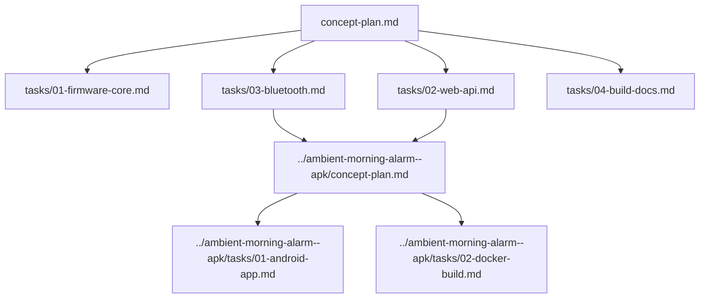

# ambient-morning-alarm concept plan

Световой будильник на Tenstar Robot ESP32-C3 Super Mini включает 12-вольтовую
светодиодную ленту через IRF520 MOSFET в заданное время, поддерживает обратный
таймер и даёт одинаковые настройки через веб-страницу, HTTP JSON API и
Bluetooth для Android-приложения.

Этот документ фиксирует общий контракт проекта. Отдельные файлы в `tasks/`
можно отдавать агентам в разных сессиях.

## Железо

- Контроллер: Tenstar Robot ESP32-C3 Super Mini.
- Ключ ленты: модуль IRF520 MOSFET.
- Питание ленты: внешний блок 12 В.
- Питание контроллера: DC-DC преобразователь 12 В -> 5 В.
- Нагрузка: светодиодная лента 12 В.

## Схема подключения

```text
                         Блок питания 12 В
                   +-------------+-------------+
                   |                           |
                   |                           |
              +----v----+                 +----v------------------+
              | DC-DC   |                 | IRF520 MOSFET module  |
              | 12 -> 5 |                 |                       |
              +----+----+                 | VIN+ / V+  <- +12 В   |
                   |                      | VIN- / GND <- GND     |
                   | 5 В                  | OUT+       -> лента + |
                   |                      | OUT-       -> лента - |
          +--------v---------+            | SIG        <- GPIO PWM|
          | ESP32-C3 Super   |            | GND        <- общий GND
          | Mini             |            +------------^----------+
          |                  |                         |
          | 5V/VBUS <- 5 В   |                         |
          | GND     <- GND --+-------------------------+
          | GPIO PWM -> SIG  |
          +------------------+
```

Общая земля обязательна: GND блока 12 В, GND DC-DC, GND ESP32-C3 и GND
логической части IRF520 должны быть соединены. Пин PWM выбрать в `config.h`;
не использовать загрузочные или занятые пины платы без проверки распиновки.

## Основные возможности

- 10 будильников, количество задаётся константой `ALARM_COUNT`.
- Каждый будильник можно включить или выключить.
- Время старта задаётся часами и минутами.
- Дни недели хранятся битовой маской: понедельник первый, воскресенье
  последний.
- Два режима свечения:
  - `ramp`: медленный розжиг от стартовой яркости до финишной за время
    розжига, затем выключение по окончании общей длительности.
  - `pulse`: повторяющаяся пульсация со временем розжига, временем темноты,
    стартовой и финишной яркостью, выключение по окончании общей длительности.
- Обратный таймер запускает пульсацию после заданных часов и минут ожидания.
- Тест свечения запускается вручную и не меняет сохранённые настройки.
- Активное свечение можно остановить через веб, API или Bluetooth.

## Версия и имя Bluetooth

Версия прошивки хранится как три числа:

```cpp
#define FIRMWARE_VERSION_MAJOR 0
#define FIRMWARE_VERSION_MINOR 0
#define FIRMWARE_VERSION_PATCH 1
```

Строка версии для статуса: `00.00.001`.

Bluetooth-имя строится из той же версии без точек и дефисов:
`piper-light-alarm-0000001`.

PIN Bluetooth берётся из `config.h`, значение по умолчанию `8888`.

## Общая модель данных

Один и тот же JSON-контракт используют веб-страница, HTTP API и Bluetooth.

```json
{
  "wifi": {
    "ssid": "MoyaWiFiSet",
    "password": "moy-skrytyy-parol"
  },
  "alarms": [
    {
      "id": 0,
      "enabled": true,
      "hour": 7,
      "minute": 30,
      "weekdaysMask": 31,
      "mode": {
        "type": "ramp",
        "startBrightness": 5,
        "finishBrightness": 100,
        "rampSeconds": 1200,
        "totalSeconds": 1800,
        "darkSeconds": 0
      }
    }
  ],
  "timer": {
    "hours": 0,
    "minutes": 30,
    "mode": {
      "type": "pulse",
      "startBrightness": 5,
      "finishBrightness": 100,
      "rampSeconds": 5,
      "darkSeconds": 5,
      "totalSeconds": 600
    }
  }
}
```

WiFi, будильники и таймер сохраняются в Preferences (NVS) и переживают потерю
питания. После включения контроллер читает NVS, подключается к сохранённой
сети, синкает NTP и продолжает работу по сохранённой конфигурации. Активный
запуск света в момент отключения не восстанавливается.

Ограничения:

- `id`: от `0` до `ALARM_COUNT - 1`.
- `hour`: `0..23`.
- `minute`: `0..59`.
- `weekdaysMask`: бит 0 = понедельник, бит 6 = воскресенье.
- `startBrightness` и `finishBrightness`: проценты `0..100`.
- Все длительности задаются в секундах.

## Статус устройства

Статус должен включать:

```json
{
  "currentTime": "2026-09-10T07:30:15",
  "firmwareVersion": "00.00.001",
  "ntpSynced": true,
  "wifiConnected": true,
  "activeRun": {
    "type": "alarm",
    "alarmId": 0,
    "mode": "ramp",
    "startedAt": "2026-09-10T07:30:00",
    "remainingSeconds": 1785,
    "brightness": 6
  }
}
```

Если ничего не светится, `activeRun` должен быть `null`.

## Карта подзадач



## Порядок делегирования

1. Агент прошивки выполняет `tasks/01-firmware-core.md`.
2. Агент веб/API выполняет `tasks/02-web-api.md`, опираясь на модели из ядра.
3. Агент Bluetooth выполняет `tasks/03-bluetooth.md`, не меняя смысл JSON.
4. Агент сборки и документации выполняет `tasks/04-build-docs.md`.
5. После фиксации Bluetooth-контракта агент Android выполняет
   `../ambient-morning-alarm--apk/tasks/01-android-app.md`.
6. Агент Docker выполняет `../ambient-morning-alarm--apk/tasks/02-docker-build.md`.

## Ссылки на соседние проекты

- `../silomer-stanovaya/readme.md`: стиль описания схемы, WiFi-режимов,
  веб-интерфейса и JSON API.
- `../silomer-stanovaya/sborka.sh`: пример передачи WiFi-секретов через
  `.env` и `compiler.cpp.extra_flags`.
- `../lolin-web-pulse/lolin-web-pulse.ino`: пример HTML-страницы внутри
  прошивки и простого JSON endpoint.
- `../nano-pulse-light/readme.md`: пример управления 12 В лентой через IRF520
  и объяснения аппаратных ограничений.

